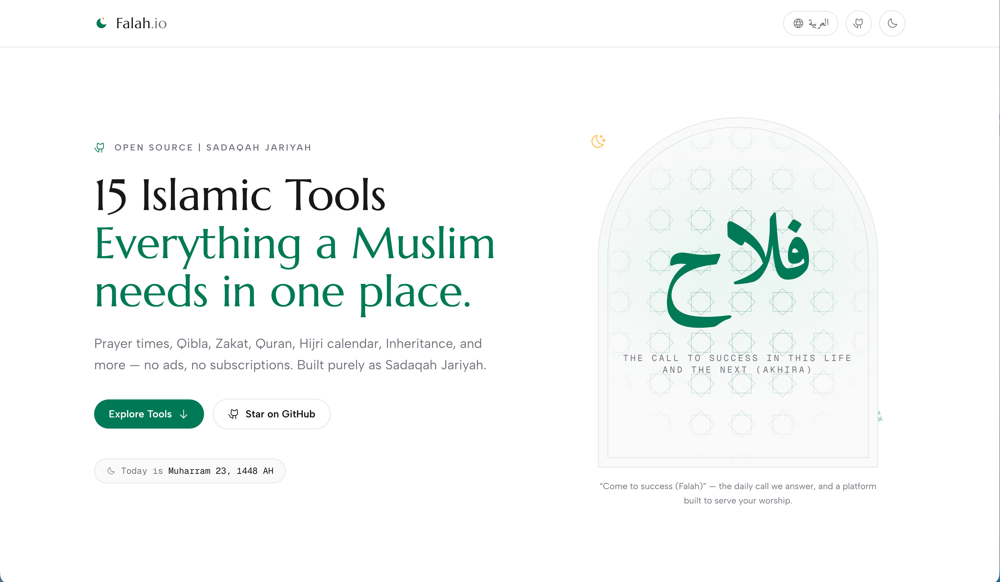

# 🌙 Falah.io — Open-source Islamic Tools

[](https://github.com/abdessamadbettal/falah)
[](https://nextjs.org)
[](https://tailwindcss.com)
[](https://iconify.design)
[](https://falah.io)
[](https://falah.io)

> *"Come to success (Falah)” — the daily call we answer, and a platform built to serve your worship."*  
> **Every Muslim deserves access to accurate Islamic tools without creating accounts, handing over location data, or hitting paywalls.**

**Falah.io** is an open-source Islamic toolkit (Quraan explorer, Hadith collections, Prayer Times, Hijri Calendar, Qibla finder, nearby Mosques, and Inheritance & Zakat calculators and +16 tools more). Built purely as **Sadaqah Jariyah** (continuous charity), Zero Ads — everything runs client-side directly in your browser. No backend databases harvesting your GPS, no premium subscriptions, and no hidden monetization—just clean, modern, and accessible tools for the Ummah.



---

## Why Falah.io?

Most modern Islamic apps rely on invasive location tracking, aggressive ads, or locking basic religious necessities behind paywalls. **Falah is different by design:**

- **Private & Client-Side:** All calculations (Prayer Times, Quran Explorer, Qibla, and Inheritance & Zakat calculators) happen locally on your device — your location and financial inputs never leave your browser.
- **Zero Ads & No Paywalls:** Faith should never be monetized. No advertisements, sponsored listings, or premium-only features.
- **Offline-Ready & Lightning Fast:** Built with Next.js static architecture for excellent performance and offline capabilities.
- **No Accounts Required:** Open the app and instantly access every feature without signing up.
- **Multilingual Support:** Available in [**English**](https://falah.io/en) and [**Arabic (العربية)**](https://falah.io/ar) with full right-to-left layout. French is on the roadmap.

---

# The Toolkit

## Time & Daily Worship

- **Prayer Times & Adhan**
  - Accurate prayer times for your location or any city worldwide.
  - Customizable Adhan notifications.

- **Hijri Smart Calendar**
  - Islamic calendar.
  - White Days (Ayyam al-Bid) reminders.
  - Calendar export support.

- **Ramadan Countdown**
  - Countdown to Ramadan.
  - Daily Ramadan companion.

- **Hijri ↔ Gregorian Converter**
  - Instant calendar conversion.

---

## Direction & Local Community

- **Qibla Finder**
  - Compass-based Qibla direction.
  - Uses device sensors locally.

- **Mosque Finder**
  - Find nearby mosques and prayer spaces.
  - Uses browser geolocation only.

---

## Quran & Islamic Knowledge

- **Al-Qur'an Explorer**
  - Beautiful Quran reader.
  - Clean Arabic typography.
  - 📖 Uthmani Quran script
  - 🎧 Audio recitation from multiple reciters
  - 🌍 Multiple translations
  - 💡 Instant translation on hover or tap (so you can read without leaving the Arabic text)
  - ⏯️ Verse-by-verse playback
  - ⚡ Playback speed control
  - 🔤 Adjustable Arabic font size
  - 🌙 Dark mode and responsive design
  - 🔗 Every reading unit has its own prerendered page — see below

### Quran URL structure

Beyond the interactive reader at `/quran`, the whole Quran is prerendered as
static, indexable pages — four views of the same text, one per way people
actually look it up:

| Route | Count | Example |
|-------|-------|---------|
| `/[locale]/quran/surah/[slug]` | 114 | [`/en/quran/surah/al-kahf`](https://falah.io/en/quran/surah/al-kahf/) |
| `/[locale]/quran/juz/[n]` | 30 | [`/en/quran/juz/30`](https://falah.io/en/quran/juz/30/) |
| `/[locale]/quran/hizb/[n]` | 60 | [`/en/quran/hizb/59`](https://falah.io/en/quran/hizb/59/) |
| `/[locale]/quran/page/[n]` | 604 | [`/en/quran/page/255`](https://falah.io/en/quran/page/255/) |

Each page ships the full Arabic text and translation in the HTML (no
client-side fetch), with its own title, description, canonical, hreflang and
`schema.org` `Chapter` / `Book` data. Surah slugs are fixed in
`lib/quran-meta.ts` so URLs never shift with an upstream API's spelling.

The text is downloaded once by `npm run prebuild` into `.quran-cache/`
(git-ignored) — `next build` renders ~1,600 pages across parallel workers, so
they read from disk rather than hitting the API each.

- **Tafseer Explorer**
  - Read explanations and commentary alongside verses.

- **Hadith Collections**
  - 36,000+ hadiths, every collection in full.
  - 📚 The six canonical books — Bukhari, Muslim, Abu Dawud, Tirmidhi, Nasa'i, Ibn Majah
  - 📜 Muwatta Malik, plus the Forty Hadith of an-Nawawi, the Forty Hadith Qudsi and Shah Waliullah's Forty
  - 🕌 Original Arabic with an English translation, side by side or either alone
  - ✅ Authentication grades (Al-Albani, Zubair Ali Zai, Shu'ayb al-Arna'ut and six others) with a colour for sahih / hasan / da'if
  - 🔍 Instant filter within a book, matching Arabic with or without harakat
  - 🔗 Every book of every collection has its own prerendered page — see below

### Hadith URL structure

Beyond the searchable hub at `/hadith`, every collection and every kitab
inside it is prerendered as a static, indexable page:

| Route | Count | Example |
|-------|-------|---------|
| `/[locale]/hadith` | 1 | [`/en/hadith`](https://falah.io/en/hadith/) |
| `/[locale]/hadith/[collection]` | 10 | [`/en/hadith/sahih-bukhari`](https://falah.io/en/hadith/sahih-bukhari/) |
| `/[locale]/hadith/[collection]/[book]` | 397 | [`/en/hadith/sahih-bukhari/revelation`](https://falah.io/en/hadith/sahih-bukhari/revelation/) |
| `/[locale]/hadith/[collection]/hadith-[n]` | 122 | [`/en/hadith/40-hadith-nawawi/hadith-13`](https://falah.io/en/hadith/40-hadith-nawawi/hadith-13/) |

Every segment is words, never a bare id — the path is the clearest place to
say what a page is about, and `book-of-belief` is what someone looking for it
actually types.

A kitab with more than 50 hadiths is split into parts — Bukhari's *Kitab
al-Maghazi* alone has 525, and one page of them would be ~1 MB of HTML. Part 1
lives at the book's own URL, so a short kitab never gains a `/part-2`. The
three Forty Hadith collections have a single kitab, so for them the segment
after the collection is the **hadith** itself.

Collection slugs live in `lib/hadith-meta.ts` and book slugs in
`lib/hadith-chapters.ts` — generated once, committed, and checked for
collisions, so a URL can never shift because an upstream dataset changed its
spelling. Every page ships the full Arabic and translation in the HTML (no
client-side fetch), with its own title, description, canonical, hreflang and
`schema.org` `Book` / `Chapter` / `Quotation` data. Slugs are shared by both
locales, because switching language only swaps the `/en` `/ar` prefix.

**Where the text comes from.** Hadiths, translations and gradings are from the
open [hadith-api](https://github.com/fawazahmed0/hadith-api) dataset. Arabic
book titles come from a second, independent dataset
([hadith-json](https://github.com/AhmedBaset/hadith-json)) and every one of the
397 is cross-checked against the first before being committed — the generator
refuses to emit a title whose chapter numbering disagrees between the two.
Around 1% of hadiths have no Arabic text upstream and are not published at
all, so a collection's count here can be slightly below its printed total.

- **99 Names of Allah**
  - Meanings.
  - Audio pronunciations.
  - Explanations.

- **Hisnul Muslim**
  - Authentic daily Duas.
  - Organized by category.

---

## Islamic Calculators

- **Zakat Calculator**
  - Cash
  - Gold
  - Silver
  - Investments
  - Business assets
  - Live Nisab values

- **Islamic Inheritance Calculator (Fara'id)**
  - Accurate inheritance distribution.

- **Hijri Age Calculator**
  - Exact Hijri age.
  - Islamic milestone tracker.

---

## Creative & Utility Tools

- **Quran Card Maker**
  - Generate beautiful Quran verse cards.
  - Share on social media.

- **Arabic Letterhead Date Stamp**
  - Professional Hijri date headers.
  - Islamic document stamps.

---

# Tech Stack

| Technology | Purpose |
|------------|---------|
| **Next.js 16** | React framework using Static Export for fast client-side performance |
| **Tailwind CSS** | Responsive modern UI with dark mode support |
| **Iconify** | Lightweight SVG icons |
| **HTML5 Geolocation** | Local-only mosque finding |
| **DeviceOrientation API** | Local-only Qibla direction |

---

# Getting Started

## Prerequisites

- Node.js **20+**
- npm, pnpm, or yarn

## Installation

### 1. Clone the repository

```bash
git clone https://github.com/abdessamadbettal/falah.git
cd falah
```

### 2. Install dependencies

```bash
npm install # or pnpm install # or yarn install
```

### 3. Start the development server

```bash
npm run dev # or pnpm dev # or yarn dev
```

### 4. Open your browser

Visit:

```
http://localhost:3000
```

---

# Contributing

Falah.io is a community-driven project built as **Sadaqah Jariyah**.

There are many ways to contribute:

- 💻 Submit code improvements.
- 🌐 Help translate the project (Arabic today — French is next).
- 🐞 Report bugs.
- 📖 Improve documentation.
- 📢 Share the project with others.

Pull Requests are always welcome — start with the **[Contributing Guide](CONTRIBUTING.md)**, which covers local setup, the pre-PR checklist, and a step-by-step recipe for adding a new tool or language.

---

# Sadaqah Jariyah

This project will always remain:

- ✅ Open Source
- ✅ Privacy First (inputs stay on-device; anonymized analytics only)
- ✅ No Ads
- ✅ No Premium Tier
- ✅ No Selling of Your Data

If you'd like to help cover hosting and domain costs, voluntary donations are appreciated as **Sadaqah Jariyah**.

---

# License

Licensed under the **MIT License**.

You are free to use, modify, distribute, and learn from this project.

---

> **May Allah accept this effort and make it beneficial for the Ummah. Ameen.**